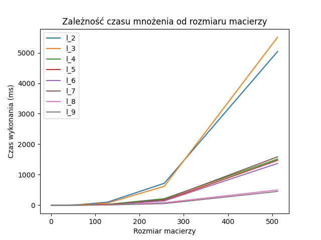

# Algorytm mnożenia macierzy

### Karol Markowicz, Paulina Dziwak

# Rekurencyjne mnożenie macierzy - "opis pseudokodu"

Opisy z chata - można wykorzystać 

### Algorytm tradycyjny

Algorytm tradycyjny jest prostym algorytmem, który wykonuje mnożenie macierzy poprzez iteracyjne przemnożenie elementów wiersza pierwszej macierzy przez odpowiadające elementy kolumny drugiej macierzy.

Dla macierzy o rozmiarze mniejszym lub równym 2l x 2l, algorytm tradycyjny jest skuteczny i wydajny.

### Algorytm rekurencyjny Binéta

Algorytm rekurencyjny Binéta opiera się na dzieleniu macierzy na mniejsze podmacierze, a następnie rekurencyjnym ich mnożeniu. Jest on bardziej efektywny dla większych macierzy, ponieważ redukuje liczbę operacji do wykonania poprzez podział macierzy na mniejsze części.

Algorytm rekurencyjny Binéta jest preferowany dla macierzy o rozmiarze większym od 2l x 2l, ponieważ pozwala na zmniejszenie złożoności obliczeniowej w porównaniu z algorytmem tradycyjnym.

  

